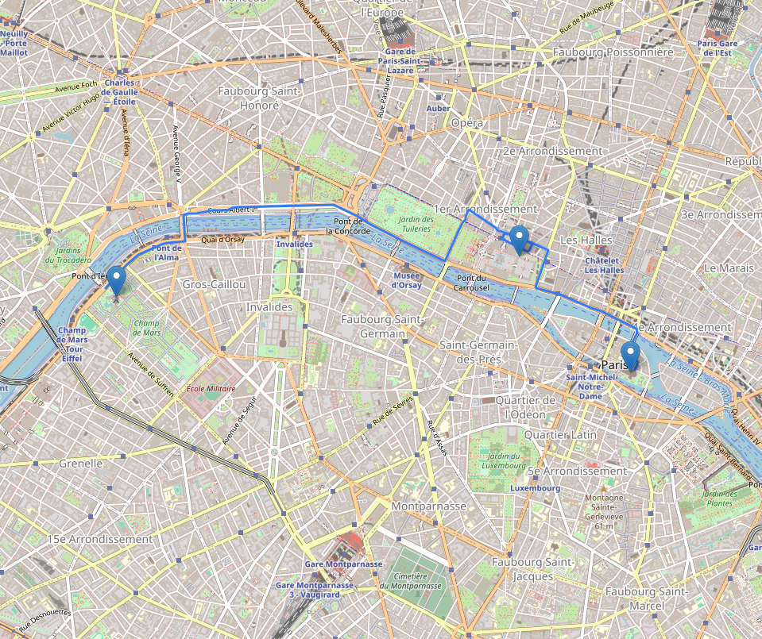

# 🚀 Route Planner


[🇫🇷 Lire en Français](README.md)

**Route Planner** is a flexible and powerful solution to generate routes from a list of addresses, with travel time and cost estimation based on vehicle characteristics. Thanks to its **Factory Pattern** architecture, it allows dynamic selection between multiple routing engines, such as **OSRM** or **OSMnx**.

> 🌍 Visualize your routes on an interactive HTML map, and instantly get accurate distance, travel time, and cost estimations.

---

## ✨ Features

- 🔹 **Multi-routing**: Choose between OSRM (fast API) or OSMnx (local computation).
- 📍 **Smart geocoding** from addresses.
- 🛣️ **Automatic route plotting**.
- ⏱️ **Travel time estimation** based on transport mode (car, bike, pedestrian).
- 💰 **Cost calculation** based on consumption and energy price.
- 🗺️ **Interactive map export** in HTML format.
- 🏗️ Scalable architecture following **SOLID** principles.

---

## ⚡ Preview

  
*Example of a route generated between several points in Paris using OSRM.*

---

## 🚧 Architecture

```
route_planner/
├── main.py                 # Entry point
├── route_planner.py        # Routing and export coordination
├── vehicule.py             # Vehicle model
├── routers/                # Router implementations
│   ├── factory.py
│   ├── osrm_router.py
│   └── interface.py
├── exporters/              # Export management
    └── html_exporter.py
```

---

## 🚀 Local Installation

1. **Clone the repository:**
```bash
git clone https://github.com/RomainBerthet/RoutePlanner.git
cd route_planner
```

2. **Install dependencies:**
```bash
pip install -r requirements.txt
```

## Install the `route_planner` package:

```bash
pip install route_planner
```

---

## 🎮 Local Usage

Edit the `main.py` file with your addresses and vehicle specifications:

```python
adresses = [
    "Tour Eiffel, Paris",
    "Louvre, Paris",
    "Notre-Dame de Paris"
]

vehicule = Vehicule(type_transport='drive', consommation_l_km=0.06, cout_energie=1.8)
planner = RoutePlanner(vehicule, methode_routage='osrm')
planner.generer_parcours(adresses, "parcours_paris")
```

Then simply run:

```bash
python main.py
```

✅ A `parcours_paris.html` file will be generated with your interactive route.

---

## 🎮 Example using the `route_planner` package

```python
from route_planner import Vehicule, RoutePlanner

adresses = [
    "Tour Eiffel, Paris",
    "Louvre, Paris",
    "Notre-Dame de Paris"
]

vehicule = Vehicule(type_transport='drive', consommation_l_km=0.06, cout_energie=1.8)
planner = RoutePlanner(vehicule, methode_routage='osrm')
planner.generer_parcours(adresses, "parcours_paris")
```

---

## ⚙️ Available Parameters

| Parameter         | Description                                      | Example        |
|-------------------|--------------------------------------------------|----------------|
| `type_transport`  | Transport mode (`drive`, `bike`, `walk`)         | `'drive'`      |
| `methode_routage` | Routing engine (`osrm`, `osmnx`)                 | `'osrm'`       |
| `consommation_l_km` | Consumption per km (L or kWh)                  | `0.06`         |
| `cout_energie`    | Energy price (€ per L or kWh)                    | `1.8`          |

---

## 🚀 Roadmap

- [x] OSRM Integration
- [ ] Full OSMnx Support
- [ ] PDF / PNG Export
- [ ] Add "Tourist Walking" Mode
- [ ] GraphHopper Integration
- [ ] Minimal Web Interface (Flask)

---

## 🤝 Contributing

Contributions are welcome!  
Feel free to open issues or submit pull requests to improve the project.

---

## 📄 License

This project is licensed under the **MIT License** — feel free to use, modify, and share it.

---

## 🙌 Acknowledgements

- [OSRM Project](http://project-osrm.org/)
- [OpenStreetMap](https://www.openstreetmap.org/)
- [Folium](https://python-visualization.github.io/folium/)

> ⭐ Don't forget to leave a **star** if you find this project useful!
