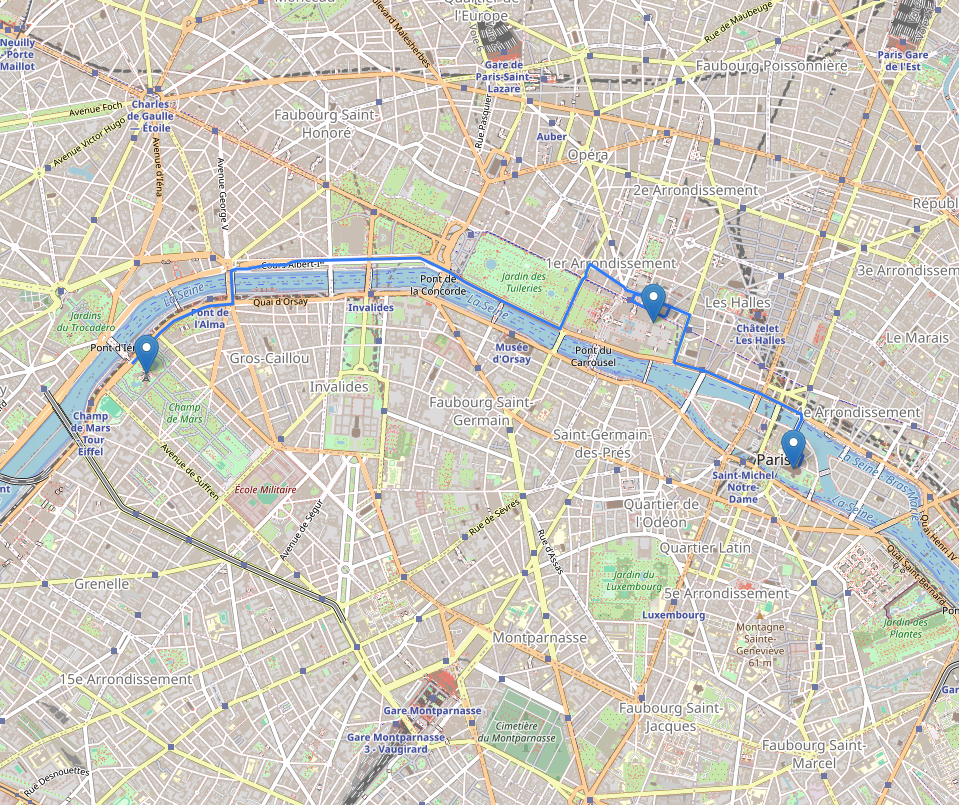

# 🚀 Route Planner Factory


**Route Planner Factory** est une solution flexible et puissante pour générer des itinéraires à partir d'une liste d'adresses, avec estimation du temps et du coût selon les caractéristiques d'un véhicule. Grâce à son architecture basée sur le **Factory Pattern**, il permet de choisir dynamiquement entre plusieurs moteurs de calcul de routes, comme **OSRM** ou **OSMnx**.

> 🌍 Visualisez vos parcours sur une carte interactive, exportée au format HTML, et obtenez instantanément des estimations précises de distance, temps de trajet et coût.

---

## ✨ Fonctionnalités

- 🔹 **Multi-routage** : Choisissez entre OSRM (API rapide) ou OSMnx (calcul local).
- 📍 **Géocodage intelligent** à partir d'adresses.
- 🛣️ **Traçage automatique** des itinéraires.
- ⏱️ **Estimation du temps de trajet** basée sur le profil (voiture, vélo, piéton).
- 💰 **Calcul du coût du trajet** selon la consommation et le prix de l'énergie.
- 🗺️ **Export interactif** de la carte au format HTML.
- 🏗️ Architecture extensible et conforme aux principes **SOLID**.

---

## ⚡ Aperçu

  
*Exemple de parcours généré entre plusieurs points à Paris avec OSRM.*

---

## 🚧 Architecture

```
route_planner_factory/
├── main.py                 # Point d'entrée
├── route_planner.py        # Coordination du routage et export
├── vehicule.py             # Modèle de véhicule
├── routers/                # Implémentations des routeurs
│   ├── factory.py
│   ├── osrm_router.py
│   └── interface.py
├── exporters/              # Gestion des exports
│   └── html_exporter.py
├── requirements.txt
└── README.md
```

---

## 🚀 Installation

1. **Clonez le dépôt :**
```bash
git clone https://github.com/RomainBerthet/RoutePlanner.git
cd route_planner_factory
```

2. **Installez les dépendances :**
```bash
pip install -r requirements.txt
```

---

## 🎮 Utilisation

Modifiez le fichier `main.py` selon vos adresses et caractéristiques de véhicule :

```python
adresses = [
    "Tour Eiffel, Paris",
    "Louvre, Paris",
    "Notre-Dame de Paris"
]

vehicule = Vehicule(type_transport='drive', consommation_l_km=0.06, cout_energie=1.8)
planner = RoutePlanner(vehicule, methode_routage='osrm')
planner.generer_parcours(adresses, "parcours_paris")
```

Puis lancez simplement :

```bash
python main.py
```

✅ Un fichier `parcours_paris.html` sera généré avec votre itinéraire interactif.

---

## ⚙️ Paramètres disponibles

| Paramètre         | Description                                      | Exemple        |
|-------------------|--------------------------------------------------|----------------|
| `type_transport`  | Mode de transport (`drive`, `bike`, `walk`)      | `'drive'`      |
| `methode_routage` | Moteur utilisé (`osrm`, `osmnx`)                 | `'osrm'`       |
| `consommation_l_km` | Consommation au km (L ou kWh)                  | `0.06`         |
| `cout_energie`    | Prix de l'énergie (€ par L ou kWh)               | `1.8`          |

---

## 🚀 Roadmap

- [x] Intégration OSRM
- [ ] Support complet OSMnx
- [ ] Export PDF / PNG
- [ ] Ajout d'un mode "piéton touristique"
- [ ] Intégration de GraphHopper
- [ ] Interface web minimale (Flask)

---

## 🤝 Contribuer

Les contributions sont les bienvenues !  
N'hésitez pas à ouvrir des issues ou proposer des pull requests pour améliorer le projet.

---

## 📄 Licence

Ce projet est sous licence **MIT** — libre à vous de l'utiliser, le modifier et le partager.

---

## 🙌 Remerciements

- [OSRM Project](http://project-osrm.org/)
- [OpenStreetMap](https://www.openstreetmap.org/)
- [Folium](https://python-visualization.github.io/folium/)

> ⭐ N'oubliez pas de laisser un **star** si ce projet vous a été utile !
