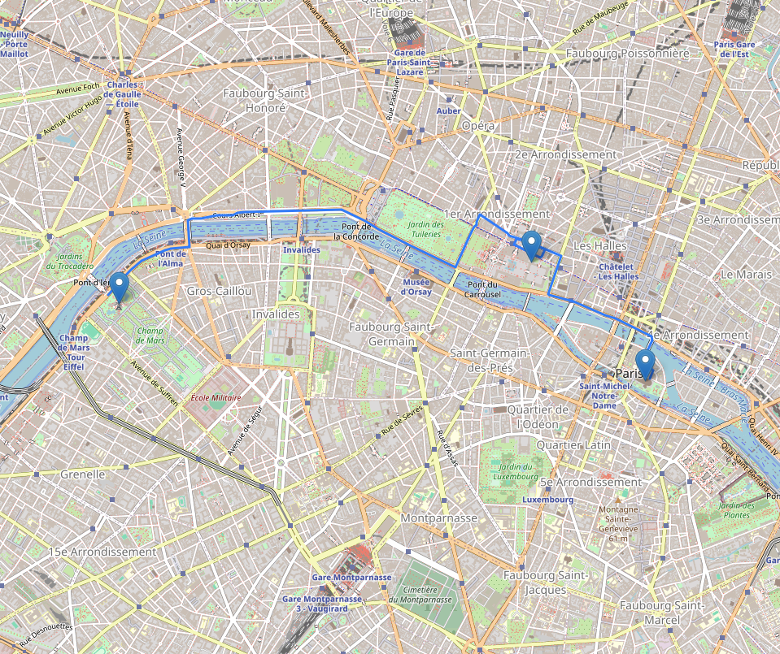

# Route Planner

[](https://www.python.org/)
[](pyproject.toml)
[](pytest.ini)
[](LICENSE)
[](https://www.openstreetmap.org/)

Planificateur d'itineraire multi-moteurs pour construire, optimiser et exporter des parcours a partir d'une liste d'adresses.

Route Planner combine une interface web locale, un CLI et une API Python. Il gere plusieurs modes de deplacement, plusieurs objectifs d'optimisation, des exports HTML/PDF/JSON et des statistiques adaptees au mode choisi.

[Read in English](README.en.md)



## Points Forts

- Routage multi-moteurs : OSRM, OSMnx, Valhalla, GraphHopper et BRouter.
- Modes de deplacement : voiture, velo, marche.
- Optimisation de l'ordre des etapes des parcours multi-points.
- Objectifs : plus rapide, plus court, moins couteux, equilibre temps/distance.
- Configuration dynamique selon le moteur choisi : URLs, cle API GraphHopper, service Valhalla, service BRouter.
- Champs adaptes au mode : budget, peages, consommation et cout energie uniquement quand ils sont pertinents.
- Statistiques contextualisees : cout/CO2 en voiture, calories/CO2 evite en velo, pas/allure/calories en marche.
- Exports automatiques : carte HTML interactive, feuille PDF et donnees JSON.
- **Recommandations de lieux a visiter** autour de chaque etape (service reutilisable base sur OpenStreetMap / Overpass).
- **Carnet de voyage HTML** illustre et autonome (hero, carte stylisee, jour par jour, carnet d'adresses) genere depuis un parcours.
- **Connecteur IA pluggable** (Anthropic / OpenAI / vLLM) : deduit les etapes d'une demande en langage naturel et redige le contenu du carnet (astuces, points de vigilance, recap budget, spots secrets, conseils pratiques).
- Cache SQLite pour limiter les appels repetes de geocodage, de matrices et de recommandations.

## Installation

```bash
git clone https://github.com/RomainBerthet/RoutePlanner.git
cd RoutePlanner
python -m venv .venv
source .venv/bin/activate
pip install -r requirements.txt
pip install -e .
```

Verification rapide :

```bash
pytest
```

## Lancer L'Interface Web

```bash
route-planner-web --host 127.0.0.1 --port 8000
```

Ouvrez ensuite :

```text
http://127.0.0.1:8000
```

L'interface affiche uniquement les champs utiles au contexte :

| Selection | Champs visibles |
| --- | --- |
| `Voiture` | budget, peages, consommation, cout energie |
| `Velo` | objectifs temps/distance/equilibre, stats velo |
| `Marche` | objectifs temps/distance/equilibre, stats marche |
| `Valhalla` | URL du service Valhalla |
| `GraphHopper` | URL GraphHopper et cle API |
| `BRouter` | URL du service BRouter |

## Utilisation CLI

Calcul simple avec OSRM :

```bash
route-planner \
  --method osrm \
  --mode drive \
  --objective fastest \
  --addresses "Tour Eiffel, Paris" "Musee du Louvre, Paris" "Notre-Dame de Paris" \
  --output parcours_paris \
  --json-output parcours_paris.json
```

Exemple velo avec BRouter :

```bash
route-planner \
  --method brouter \
  --mode bike \
  --objective balanced \
  --balanced-weight 0.4 \
  --addresses "Bastille, Paris" "Canal Saint-Martin, Paris" "Montmartre, Paris"
```

Exemple GraphHopper avec cle API :

```bash
route-planner \
  --method graphhopper \
  --graphhopper-api-key "$GRAPHHOPPER_API_KEY" \
  --mode drive \
  --avoid-tolls \
  --addresses "Lyon" "Grenoble" "Chambery"
```

## Utilisation Python

```python
from route_planner import RoutePlanner, Vehicule

adresses = [
    "Tour Eiffel, Paris",
    "Musee du Louvre, Paris",
    "Notre-Dame de Paris",
]

vehicule = Vehicule(
    type_transport="drive",
    consommation_l_km=0.06,
    cout_energie=1.8,
)

planner = RoutePlanner(
    vehicule,
    methode_routage="osrm",
    objective="balanced",
    balanced_weight=0.6,
    avoid_tolls=True,
    budget_eur=12.0,
)

plan = planner.planifier_parcours(adresses)

print(plan.ordered_addresses)
print(plan.distance_km, plan.duration_h, plan.cost_eur)
print(plan.stats)
```

Exporter une carte HTML :

```python
planner.exporter.exporter(plan, filename="parcours_paris")
```

## Recommandations & Carnet De Voyage

Route Planner peut enrichir n'importe quel parcours avec des **lieux a visiter**
(sites, points de vue, nature, plages, culture, ou l'on mange et boit) proches de
chaque etape, puis produire un **carnet de voyage HTML** autonome et illustre,
dans l'esprit d'un guide.

Le service de recommandations est independant du routage : il prend un
`RoutePlan` (ou une simple coordonnee) et interroge OpenStreetMap via l'API
Overpass (gratuite, sans cle). Les resultats sont scores (categorie, proximite,
notoriete), dedupliques et mis en cache.

En CLI :

```bash
route-planner \
  --method osrm --mode drive \
  --addresses "Tavaux" "Ascona" "Sirmione" "Piran" "Ljubljana" \
  --output parcours --guide \
  --recommend-radius 8000 --recommend-limit 8
# -> parcours-carnet.html
```

En Python :

```python
from route_planner import (
    RoutePlanner, Vehicule, RecommendationService, TravelGuideExporter,
)

planner = RoutePlanner(Vehicule("drive", 0.06, 1.8), methode_routage="osrm")
plan = planner.planifier_parcours(["Tavaux", "Ascona", "Piran", "Ljubljana"])

recommandations = RecommendationService(radius_m=8000, per_stop_limit=8).recommend_for_plan(plan)
TravelGuideExporter().exporter(plan, recommandations, filename="carnet")
# -> carnet.html
```

Categories disponibles : `sight`, `viewpoint`, `nature`, `beach`, `museum`,
`religious`, `food`, `drink` (filtrable via `--recommend-categories` ou
l'argument `categories=` du service). Depuis l'interface web, cochez
« Generer un carnet de voyage enrichi ».

## Assistant IA (Anthropic / OpenAI / vLLM)

Un connecteur IA pluggable rend le systeme intelligent : a partir d'une demande
en langage naturel, il **deduit l'itineraire** (etapes, mode, objectif) et peut
**rediger le contenu du carnet** — astuces, points de vigilance, recap budget,
spots secrets et conseils pratiques. Le service ne depend que d'une interface
`ILLMProvider`, donc les trois backends (et tout serveur compatible OpenAI comme
LM Studio ou Ollama) sont interchangeables. Le backend Anthropic utilise le SDK
officiel avec `claude-opus-4-8` et le raisonnement adaptatif; OpenAI/vLLM
utilisent le SDK `openai`.

Les SDK sont **optionnels** — installez seulement celui du backend choisi :

```bash
pip install -e ".[anthropic]"   # ou ".[openai]", ou ".[ai]" pour les deux
export ANTHROPIC_API_KEY="..."   # ou OPENAI_API_KEY / OPENAI_BASE_URL / VLLM_URL
```

En CLI (l'IA propose les etapes, puis redige le carnet) :

```bash
route-planner \
  --ai-prompt "Road trip detente de 8 jours en voiture depuis Tavaux vers la Suisse, l'Italie et la Slovenie : lacs, terrasses et baignades" \
  --ai-provider anthropic \
  --output roadtrip --guide --ai-enrich
# -> etapes deduites, roadtrip.html (carte) et roadtrip-carnet.html (guide complet)
```

En Python :

```python
from route_planner import (
    RoutePlanner, Vehicule, RecommendationService,
    TravelGuideExporter, LLMFactory, TravelIntelligence,
)

ai = TravelIntelligence(LLMFactory.get_provider("anthropic"))  # ou "openai" / "vllm"
suggestion = ai.suggest_itinerary("Week-end velo autour d'Annecy, objectif equilibre")

planner = RoutePlanner(Vehicule(suggestion.transport_mode), methode_routage="osrm")
plan = planner.planifier_parcours(suggestion.stops)

recommandations = RecommendationService().recommend_for_plan(plan)
contenu = ai.write_guide_content(plan, recommandations, request="week-end velo")
TravelGuideExporter().exporter(
    plan, recommandations, filename="carnet",
    title=suggestion.title, subtitle=suggestion.subtitle, guide_content=contenu,
)
```

Providers : `--ai-provider anthropic|openai|vllm`, modele via `--ai-model`, URL
via `--ai-base-url` (vLLM/serveur local), cle via `--ai-api-key` (sinon variable
d'environnement). L'interface web expose un champ « Assistant IA » equivalent.

## Routeurs Disponibles

| Methode | Usage recommande | Configuration |
| --- | --- | --- |
| `osrm` | rapide, simple, efficace pour voiture/velo/marche | aucune par defaut |
| `osmnx` | calcul local via graphe OpenStreetMap | aucune par defaut |
| `valhalla` | profils avances, peages, multi-modalite possible | `VALHALLA_URL` ou champ web |
| `graphhopper` | API robuste, service public ou instance locale | `GRAPHHOPPER_API_KEY`, `GRAPHHOPPER_URL` |
| `brouter` | tres pertinent pour velo et marche | `BROUTER_URL` |

Les variables d'environnement restent optionnelles si vous renseignez les champs dans l'interface web ou les options CLI.

```bash
export VALHALLA_URL="http://localhost:8002"
export GRAPHHOPPER_API_KEY="..."
export GRAPHHOPPER_URL="https://graphhopper.com/api/1"
export BROUTER_URL="https://brouter.de/brouter"
```

## Objectifs D'Optimisation

| Objectif | Description | Modes |
| --- | --- | --- |
| `fastest` | minimise la duree | voiture, velo, marche |
| `shortest_km` | minimise la distance | voiture, velo, marche |
| `cheapest` | minimise le cout energie | voiture uniquement |
| `balanced` | compromis temps/distance | voiture, velo, marche |

Pour `balanced`, `balanced_weight` controle l'importance du temps :

- `0.0` : priorite distance.
- `0.5` : compromis equivalent.
- `1.0` : priorite duree.

## Exports

Apres calcul depuis l'interface web, Route Planner genere automatiquement :

| Format | Contenu |
| --- | --- |
| HTML | carte interactive Folium |
| PDF | feuille de route lisible |
| JSON | donnees completes du plan |

Le payload JSON contient notamment :

```json
{
  "ordered_addresses": ["A", "B", "C"],
  "distance_km": 12.34,
  "duration_h": 0.5,
  "cost_eur": 3.21,
  "routing_engine": "OSRMRouter",
  "optimization_strategy": "exact_dp",
  "stats": {}
}
```

## Architecture

```text
src/route_planner/
├── route_planner.py          # orchestration metier
├── vehicule.py               # profil de transport
├── webapp.py                 # interface web WSGI
├── cli.py                    # interface ligne de commande
├── models.py                 # RoutePlan, RouteLeg, preferences
├── optimization/
│   └── heuristics.py         # optimisation de l'ordre des etapes (DP exact + recherche locale)
├── routers/
│   ├── factory.py            # selection dynamique du moteur
│   ├── interface.py          # contrat commun
│   ├── osrm_router.py
│   ├── osmnx_router.py
│   └── http_routers.py       # Valhalla, GraphHopper, BRouter
├── recommendations/          # service reutilisable de lieux a visiter
│   ├── categories.py         # taxonomie POI -> filtres OSM
│   ├── models.py             # PointOfInterest, StopRecommendations
│   ├── service.py            # scoring, dedup, ranking
│   └── providers/
│       └── overpass.py       # source OpenStreetMap (Overpass)
├── ai/                       # connecteur IA pluggable + intelligence de voyage
│   ├── factory.py            # selection du provider (anthropic/openai/vllm)
│   ├── models.py             # ItinerarySuggestion, GuideContent
│   ├── service.py            # suggest_itinerary, write_guide_content
│   └── providers/            # anthropic (SDK officiel), openai/vllm
└── exporters/
    ├── html_exporter.py
    ├── pdf_exporter.py
    ├── json_exporter.py
    └── travel_guide_exporter.py  # carnet de voyage HTML autonome
```

## Tests

```bash
pytest
```

L'ensemble couvre :

- calcul de parcours et optimisation,
- routeurs et factory,
- interface web,
- exports HTML/PDF/JSON,
- recommandations (taxonomie, scoring, provider Overpass mocke) et carnet de voyage,
- connecteur IA (factory, modeles, service) via un provider LLM factice,
- cache SQLite,
- statistiques par mode de deplacement.

## Depannage

### `GraphHopper requiert GRAPHHOPPER_API_KEY`

Le service public GraphHopper demande une cle API. Fournissez-la via l'interface, le CLI ou l'environnement :

```bash
export GRAPHHOPPER_API_KEY="..."
```

### `graph_from_bbox() got an unexpected keyword argument 'north'`

Les versions recentes d'OSMnx utilisent un tuple de bbox. Le projet est compatible avec OSMnx 2.x.

### Valhalla ne repond pas

Par defaut, Route Planner cherche Valhalla sur :

```text
http://localhost:8002
```

Renseignez une autre URL via l'interface, `--valhalla-url` ou `VALHALLA_URL`.

## Contribution

Les contributions sont bienvenues :

1. Fork du projet.
2. Creation d'une branche courte et explicite.
3. Ajout ou mise a jour des tests.
4. Lancement de `pytest`.
5. Ouverture d'une pull request.

## Licence

Projet distribue sous licence MIT. Voir [LICENSE](LICENSE).

## Credits

- [OpenStreetMap](https://www.openstreetmap.org/)
- [OSRM](https://project-osrm.org/)
- [OSMnx](https://osmnx.readthedocs.io/)
- [Valhalla](https://valhalla.github.io/valhalla/)
- [GraphHopper](https://www.graphhopper.com/)
- [BRouter](https://brouter.de/)
- [Folium](https://python-visualization.github.io/folium/)
